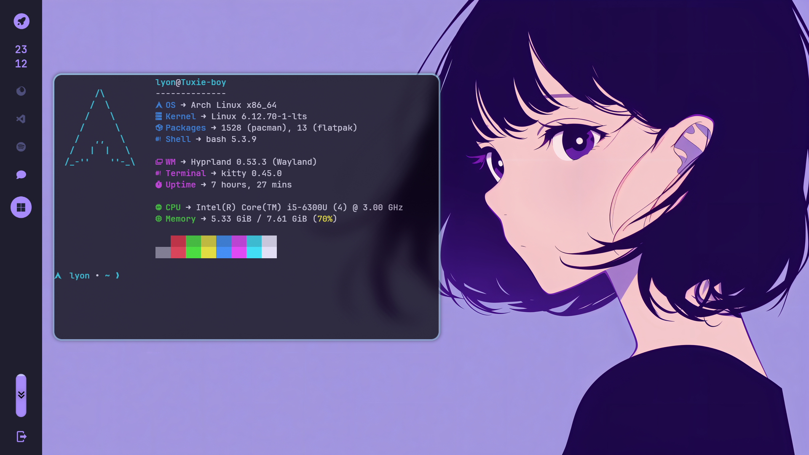
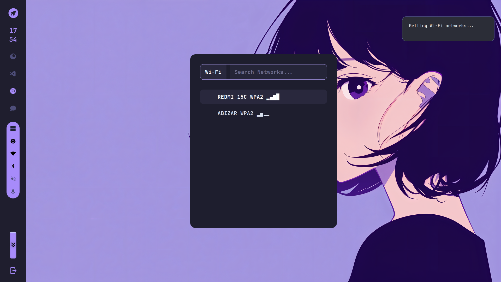

# 🍙 My Dotfiles



> Screenshot setup desktop saya (Hyprland + Waybar)

Koleksi konfigurasi (dotfiles) untuk setup Linux saya menggunakan **Hyprland** dan **Waybar**.

---

## 🖼️ Gallery

| Desktop | App Launcher |
|:---:|:---:|
|  |  |
| *Clean State* | *App Launcher* |

---

## 🛠️ Details

- **OS**: Linux
- **WM**: [Hyprland](https://github.com/hyprwm/Hyprland)
- **Bar**: [Waybar](https://github.com/Alexays/Waybar)
- **Terminal**: Alacritty / Kitty
- **Shell**: Zsh
- **Font**: JetBrains Mono Nerd Font
- **Launcher**: Wofi / Hyprlauncher

---

## 📂 Structure

Repository ini berisi konfigurasi untuk:

- **`hypr/`** : Konfigurasi utama Hyprland, keybindings, dan wallpaper.
- **`waybar/`** : Konfigurasi status bar dan styling (CSS + image preview).

---

## 🚀 Installation

### 1. Clone Repository

```bash
git clone https://github.com/USERNAME_ANDA/dotfiles.git ~/dotfiles
